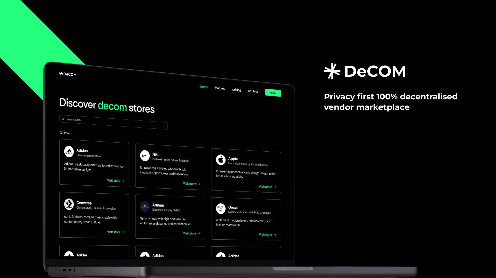

# DeCOM - Where Commerce Meets Confidentiality

> We're building DeCOM, Trade with Confidence – The Fort Knox of Online Marketplaces

## What are we solving?

In an era where data breaches are rampant, DeCOM revolutionizes online marketplaces. Traditional platforms pose risks, when they get hacked, sensitive data leaks, jeopardizing privacy and security. DeCOM changes this narrative by offering a **unique**, **privacy-first** marketplace.

Our custom encryption scheme(Based on **ECIES**), layered over Filecoin, guarantees that vendor data, buyer PII information, delivery details, and invoices, though on-chain, remain invisible to prying eyes.

Vendors can effortlessly create their own marketplaces, enjoying **multi-chain support** and **escrow services** for secure and fraud-less transactions. For vendors needing proof of personhood, **KYC verification** is seamlessly integrated.

Our platform not only makes online selling safer but also more efficient. With encrypted live chats and notifications for uninterrupted communication between vendors and buyers and much much more, we’re setting the new standard for buying and selling anything online

## Challenges we ran into

Building DeCOM was an ambitious venture, especially within a limited timeframe. Key challenges included:

- **Project Management**: The vast scope of the project demanded effective management and meticulous feature tracking to meet deadlines.
- Without making our own crypto, using global standards, crafting a unique **encryption scheme was a complex task**. We experimented with various models before finalizing our current efficient and secure system.
- **Technical Hurdles with Lighthouse**: Integrating with Lighthouse presented challenges, particularly with the uploadEncrypted function. We innovated a solution by converting files to base64 for upload and decryption on demand.
- **Multi-Chain Deployment**: Implementing multi-chain support was especially challenging due to its complexity and the project's tight schedule.

Despite these challenges, our dedication and innovative approaches led to the successful creation of DeCOM, setting a new standard for privacy and decentralization in e-commerce

## Tracks we built for

To be populated
